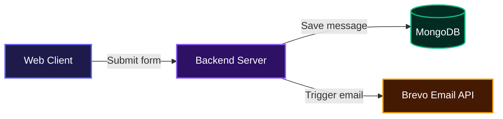
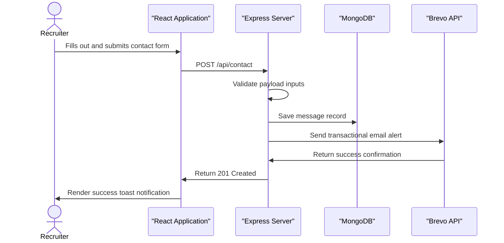

# Anas Portfolio

This project helps recruiters and engineering teams evaluate a developer's practical experience through an interactive web interface. It centralizes a professional background, live project demonstrations, and a direct communication channel into one accessible platform. There is no complicated setup involved, just a straightforward information delivery system that highlights technical capabilities.

**Live site:** [anas-portfolio-2004.vercel.app](https://anas-portfolio-2004.vercel.app)

## System Architecture



## Installation

Clone the repository to your local machine:

```bash
git clone https://github.com/Anas2694/Portfolio.git
```

Navigate into the project directory and install the dependencies:

```bash
cd Portfolio
npm install
```

Create a `.env` file in the root directory and configure the required environment variables:

```txt
PORT=5055
MONGODB_URI=your_mongodb_connection_string
BREVO_API_KEY=your_brevo_api_key
BREVO_SENDER=sender@example.com
MY_EMAIL=destination@example.com
```

Start both the client and server development environments concurrently:

```bash
npm run dev
```

## Usage

Once the development server is running, open your browser and navigate to `http://localhost:5173`. Visitors can scroll through the interactive sections to view education, certifications, and live project demos.

The portfolio includes a fully functional contact form at the bottom of the page. When a user fills out their name, email, and message, the frontend securely dispatches a payload to the backend server. The backend handles the validation, stores the inquiry in the database, and uses the email provider to immediately notify the site owner.

To build the project for production deployment, run the build command:

```bash
npm run build
```

## Features

* **Interactive Interface**: Smooth scroll animations, responsive video previews, and a simulated terminal environment to engage visitors.
* **Live Analytics**: Displays local time and a dynamic year progress tracker right in the header.
* **Theme Customization**: Includes a global toggle to switch between light and dark modes instantly.
* **Automated Contact System**: Processes visitor inquiries, stores them persistently, and handles immediate email notifications.

Below is the execution flow for the contact form feature:



## Technologies Used

| Layer | Technology |
|---|---|
| Frontend | React.js, Vite, Framer Motion |
| Backend | Node.js, Express.js |
| Database | MongoDB, Mongoose |
| External Services | Brevo API |
| Hosting / CI | Vercel |

## Contributing

Contributions are welcome. If you find a bug or have an idea for an enhancement, please open an issue or submit a pull request. Make sure to follow the existing code formatting and add descriptive commit messages for your changes.

## Author Info

* GitHub: [https://github.com/Anas2694](https://github.com/Anas2694)
* LinkedIn: [https://linkedin.com/in/mohd-viquaruddin-anas-402a14282](https://linkedin.com/in/mohd-viquaruddin-anas-402a14282)

***

[](https://reactjs.org/)
[](https://nodejs.org/)
[](https://expressjs.com/)
[](https://www.mongodb.com/)
[](https://vitejs.dev/)

[](https://dokugen.samueltuoyo.com)
